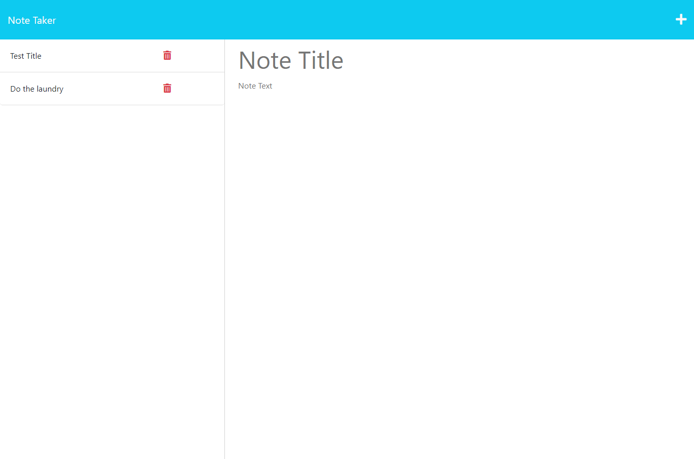

# Note Taker

## Description
Note Taker allows you to write, save and delete notes to keep track of your day.

## Table of Contents
- [Installation](#installation)
- [Usage](#usage)
- [License](#license)
- [Contributing](#contributing)
- [Tests](#tests)
- [Questions](#questions)

## Installation
N/A

## Usage

## License
This application is licensed under the [MIT](https://opensource.org/licenses/MIT) license.

## Contributing
N/A

## Tests
N/A

## Questions
If you have any questions, you can reach me at [GitHub](https://github.com/n810tran) or by email at nathaniel.k.tran@gmail.com.
